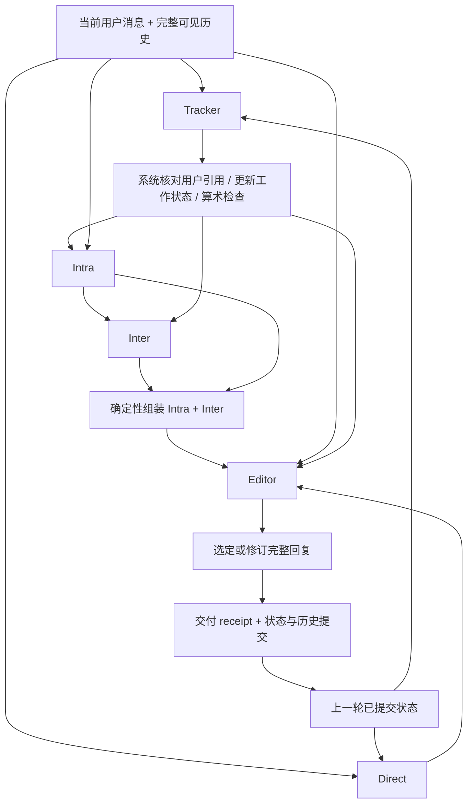

# R1 静态 Agent

R1 是当前冻结的静态系统，正式入口名为 `static_r1`。它来自 2026-10-06 拓展实验 `01_A3_R1_full` 的原始源码，不包含后来的 C1/C2 提示词或决策策略。自进化暂未启用。

## 架构与信息流



四个串行阶段、最多五次角色调用：`(Tracker || Direct) → Intra → Inter → Editor`。Tracker 完成后即可启动 Intra，不等待 Direct。没有 adjacent proposal 时跳过 Inter；没有可用 Intra 时也不调用依赖它的 Inter。Editor 等待所需分支完成。

- **Tracker**：读取完整可见历史和上一轮状态，选择原文用户证据，维护有来源的 goals 和反馈解释，提出最多三个相邻任务及可选算术表达式。系统只检查引用/原文和计算，不把检查通过当作语义正确证明。
- **Direct**：读取原始对话和上一轮状态，独立生成当前任务回复；不读取本轮 Tracker，也不自动附加 Inter。
- **Intra**：读取原始对话、本轮 Tracker 更新、用户原文证据与算术结果，输出当前任务动作和文本。
- **Inter**：读取实际 Intra 草稿，再提供未覆盖的有用延伸；可主动返回空结果。
- **Editor**：读取完整原始上下文、当前状态、Intra/Inter 两个组成部分、独立 Direct 稿、分支可用性与异议，选择 `keep_primary`、`keep_alternative` 或 `repair`。repair 必须给出完整替换回复，可附基于用户证据的 state_edits。

Direct、Intra 与 Editor 的 repair 文本 parts 动作为 `deliver / ask / revise / extend / wait`。Inter 输出 items，由系统赋予 `extend`，其来源标记为 unknown；Editor 的 keep 选择保留选中稿件已有的 parts。动作标签用于审计，系统不声称已验证其语义。最终 receipt 记录实际交付的 parts、来源、正文区间、正文 SHA256 和 ask 标识；`delivery_history` 与 `feedback_history` 增量追加。当前 goals、feedback、stall_count、execution 是当前视图。连续两次有原文支持的同一目标 stalled 会提示改变策略，并禁止原封不动重复上一轮完整回复的 keep 选项。

## 模型与调用边界

所有角色使用所选普通模型 profile 的模型、采样参数及输出预算；不加载 Trace2Skill 或 Evo-Memory。现有 baseline 入口与配置保持可用。`goal_progression` 仍指历史 R20 系统，不是 R1。

本次验收沿用 `gemini_3_6_flash_non_thinking`（minimal）和 `gpt_5_6_luna_non_thinking`（none）。Qwen 使用 `qwen_3_6_27b_vllm_non_thinking`，其原有采样参数不变。

原始五个 prompt 和通用策略文件逐字保留。上下文只含原有可读 skeleton；完整 JSON Schema 仅通过 `response_format` 传输。为兼容远程严格协议，可选字段在传输中改为 nullable，返回后将这些 null 还原为字段缺省。此处理不改变 R1 的动作或状态定义。

保持原 R1 的技术恢复：每个角色调用最多 4 次技术尝试，首次使用 schema，技术失败后的尝试使用 JSON object；单次调用 600 秒，单次交互 7200 秒。组件失败时沿用原来的降级行为并记录原因，不能把降级轨迹当作完整角色链运行。可见对话不被静默截断；本地 Qwen 使用 262144 token 上限预检，远程上下文限制由提供商报告。

## 运行

在仓库根目录安装：

```bash
python -m pip install -e './assistant[audit]' -e ./user_simulator -e ./interaction_pipeline -e ./metrics
```

交互式或单条请求，在 `assistant/` 下执行：

```bash
OPENROUTER_API_KEY="$OPENROUTER_API_KEY_1" assistant-demo --baseline static_r1 --model-profile gemini_3_6_flash_non_thinking --message '给我一个简单的交接模板'
OPENROUTER_API_KEY="$OPENROUTER_API_KEY_2" assistant-demo --baseline static_r1 --model-profile gpt_5_6_luna_non_thinking
assistant-demo --config configs/r1.yaml
```

OpenRouter 客户端读取 `OPENROUTER_API_KEY`。调用者在进程内将所需 KEY_1/KEY_2 映射到该变量；不要把密钥值写入配置或命令历史。本次验收 Gemini 使用 KEY_1，Luna 使用 KEY_2。

从 `interaction_pipeline/` 下执行前 8 条 hard 测试：

```bash
interaction-batch --all --limit 8 --baseline static_r1 \
  --assistant-model-profile gemini_3_6_flash_non_thinking \
  --simulator-model-profile deepseek_v4_flash_0731_fast \
  --difficulty hard --seed 42 --max-turns 20 \
  --sample-retries 0 --concurrency 4 --no-update-memory
```

这里 `sample-retries 0` 是单次运行命令示例。既有通用 batch runner 的重试可能覆盖之前尝试，不适合同时报告首次/重试后分数；本次验收使用独立 runner 保存所有物理尝试后分别统计。后续正式对比须继续保留完整尝试，不能拿覆盖后的结果冒充首次。

## 审计与 token 口径

正式 pipeline 保存 `r1_turn` 私有审计事件，含各角色输入输出、时序、决策、状态与交付 receipt；普通用户只看到最终回复。启动快照保存角色 prompt、哈希和实现指纹，不含密钥。

Avg.token 定义为每条 episode 用户实际收到的助手正文 token 总量的均值，排除角色 JSON、内部推理和未交付草稿。本地 Qwen 默认通过 tokenize 接口计数；跨模型比较可设置 `R1_VISIBLE_TOKENIZER=/absolute/path/to/tokenizer.json`，显式选定同一个 tokenizer。本次验收统一使用既有 Qwen tokenizer。API 模型没有配置正文 tokenizer 时，计数标记为未知，不能用内部 completion tokens 顶替；可用 `intent_metrics.visible_tokens` 离线重算。

本轮仅检验跨模型兼容性。10 个合成场景和前 8 条真实样本不能证明模型的全量 E/S，原 R1 的 Qwen 全量成绩也不能转作 Gemini/Luna 的成绩。

本轮合成验收覆盖：单行与字数限制、多轮姓名/日期纠正、已有文本修改、缺失必需材料、算术结果、可用的相邻推进、连续停滞反馈、有限重复输出、用户控制练习节奏，以及把引文中的指令作为数据处理。检查最终正文、组件降级、串行依赖、receipt 与状态提交；不把这些小规模样例视为所有语义约束的完整证明。
