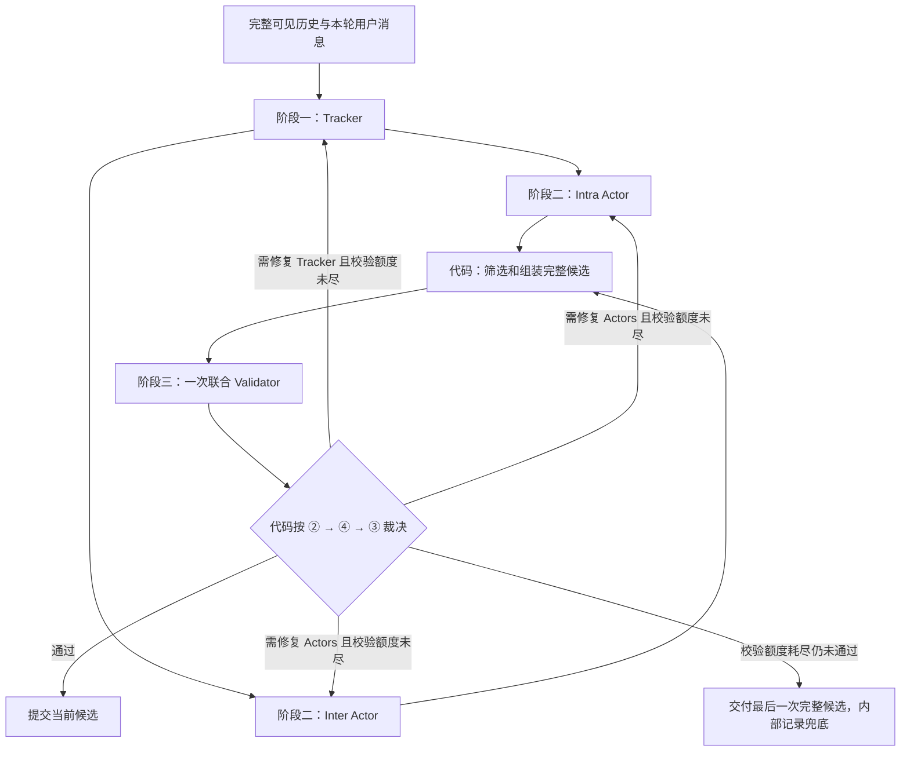

# V4 静态系统方向复审：推进策略参数与 Actor–Validator 架构

更新：2026-09-15。状态：研究与方案审查，未实现新架构、未启动真实实验。Evo 继续暂停。本次按用户最新要求明确历史输入、最小输出、原因归因、独立重试账本、最后候选兜底和 prompt 迭代预算；历史归因与参数使用量证据继续保留。

## 1. 当前判断

**我更倾向于把新的 `Tracker → 双 Actor → Validator` 作为下一步架构主线。** 相比上一版 P4，它把第三阶段用于审查本轮真实候选，并允许在交付用户前修复，直接回应了“模型知道要求却没有落实”“本轮没有推进”的问题。上一版 P4 更适合已有可靠计算判据时增加生成候选，覆盖开放语义缺陷的能力较弱。

这不是对效果的预先判定。新架构的效果仍需通过对照验证。本版以用户最新要求为准，替换上一版不再适用的“总九阶段”“校验未通过就终止”和“九次独立确认”安排：

| 提议 | 判断与需要明确的地方 |
| --- | --- |
| ④的上下文 | 至少包含上一轮完整用户与助手消息；首版在容量允许时提供完整可见交互历史，最近两轮并不总是足够 |
| 模型输出字段 | 只保留语义判断与内容；Validator 为 pass/reason，失败时 refs，仅④失败增加 cause；身份、路由和日志由系统补齐 |
| ④失败的归因 | 用户已同意按具体原因区分；模型给出必要的 cause，系统推导重跑 Tracker 或 Actors，不重复输出 owner/route |
| 两类重试 | 校验重执行每回合默认两次；其他错误恢复独立。九阶段仅是校验机制的主路径上限 |
| 校验耗尽后的行为 | 交付最后一次完整候选，继续交互；内部保留未通过结果，不把兜底改记为校验通过 |
| Prompt 与预算 | 继续使用结构化、易读的 prompt；原九次确认额度用于最多三版 prompt 的迭代，不再要求独立确认 |

继续采用 Tracker→双 Actor→联合 Validator，首版按②→④→③判断并暂缓①内容计算检查。生成参数保持冻结，推进策略参数另做对照；根据结果迭代 prompt，再决定补①或拆分裁判。上一版的并行 Generator P4 保留为备选，下文 P4 均指那个旧方案。

30 次完整 target_32 batch 上限、数据、评估器和 E/S 目标保持不变。本轮取消的是九次确认的强制预留，而非扩大总额度。2026-09-15 交接整理已将本评审落实到 [plan_v4_static.md](plan_v4_static.md)，后续 working agent 以该任务书执行，全部写入限于 runs_batch_qwen_full/gp_v4/static/；用户新授权两个 key 同时运行两批。V3 历史入口已移至 [v3](../v3/README.md)。

## 2. 先归因：责任不能只按最后一个角色分配

### 2.1 当前系统已经约束了什么，缺少什么

当前正常链路是 `Tracker → Intra / Inter 并行 → Assembler → Generator → Renderer / Session`，有三个串行模型阶段，通常四次模型请求。

- [schemas.py](src/assistant/goal_progression/schemas.py) 已有 Constraint 的 `key/value/applies_to/basis/evidence_refs`。系统已有约束表示，缺口是大多仍为自然语言字符串，没有可执行的验收语义。不能把方案表述为“从零引入约束”。
- [context.py](src/assistant/goal_progression/context.py) 为角色投影目标、约束、材料及最新用户消息。要检查的是**实际请求中的投影**，不能只看 Tracker 是否曾经记录过。
- [assembly.py](src/assistant/goal_progression/assembly.py) 负责授权、预算、去重与合同装配，不负责理解全文并校验用户约束。
- [generator.py](src/assistant/goal_progression/generator.py) 的 `validate_units` 检查 ID、覆盖、重复、正文/issue 冲突、空正文；它没有计算正文词数、费用总和或日程冲突。
- [session.py](src/assistant/goal_progression/session.py) 保存的 execution bridge 主要记录合同、交付单元、提问 Need 和回复事件。`delivered` 表示发生了交付，不等于用户限制已满足。

因此存在两个不同层面：**合同是否合法**与**合法合同的实际产物是否满足要求**。目前前者有较多代码约束，后者主要依赖生成模型执行。

### 2.2 归因规则

对同一限制依次核对：当时可见用户原文 → Tracker → 角色实际上下文 → Intra/Inter → 合同 → Generator 实际输入 → 提交正文 → 用户反馈。每个缺陷记录三项：**最早偏差、后续传播、应该发现它的检查点**。

| 已核实的现象 | 首要责任/检查对象 | 应避免的错误修复 |
| --- | --- | --- |
| 最新用户明确限定三项，Tracker 保留四项 | Tracker 的语义更新；另查原文是否正确送达 | 只让 Generator 更认真执行一个已经错误的“四项”合同 |
| Tracker 正确，角色实际请求漏了约束或材料 | ContextBuilder/引用投影 | 增加 prompt 条款掩盖数据未送达 |
| 输入正确，Intra target 与之冲突 | Intra 的计划；合同装配能否发现已编码的冲突 | 把规划错误统一记为生成失败 |
| target 与实际输入均正确，最终正文违约 | Generator 是直接生产环节；产物校验是缺失的防线 | 宣称 prompt 中出现要求就等于已经保障它 |
| 正文已修正，用户仍投诉同一缺陷 | 先验证投诉与实际版本；可能是反馈误判或更细的未满足要求 | 自动改写正确状态，或直接宣布用户/模拟器错了 |
| 所需事实确实尚未给出 | 真实依赖与交互调度 | 通过猜测天数、姓名等制造“进展” |

这里的“责任”是工程定位，不是已经完成反事实实验后的因果证明。一个缺陷可同时有生产方责任和系统漏检责任；验收规则本身也可能错。

### 2.3 原生证据：至少有三种不同问题，不能用一个 prompt 补丁概括

**案例 A：400 词要求已完整传递，Generator 仍生成过长正文。**

`user656_task2_conversation1` 的 repeat 4，第 6 轮：

| 位置 | 核验结果 |
| --- | --- |
| 用户输入，events 第 195 行 | 本轮明确给出 around 400 words。不能倒推为更早每轮都已知 |
| Tracker，第 200 行 | 目标描述、remaining_work 和约束 c0004 都保留约 400 词；c0004 引用 m11 |
| Intra，第 209 行 | target 要求约 400 词，并给出修订材料及 m11 |
| 合同，第 210 行 | 该 target 原样进入获批交付 |
| Generator 请求，第 212 行 | **实际发送的 messages** 包含最新用户消息、400 词约束和获批 target |
| 已交付正文，第 218 行 | 整段实际回复按空白分词为 **713** |

来源：[本题原始 events](../v2_6/runs_batch_qwen_full/r20_format_full292/repeat_4/20260913T182959Z_4ee15d34/user656_task2_conversation1_0172/events.jsonl)、[已保存诊断索引](proposal_artifacts/v4_static/diagnostic_evidence.json)。词数包含标题，不是模型 token 数；“约 400”没有用户给定的精确容差，但 713 与目标的距离是直接可测的。

第 7–9 轮分别为 503、500、500；第 10–16 轮为**完全相同的 499 词正文**，每轮都有 Generator 请求。这说明模型多次重新调用仍未落实缩短要求。单靠“显著压缩”“严格约 400 词”等 target 措辞已没有解决这个实例。

这也**不能归因成跨回合缓存复用**：[session.py](src/assistant/goal_progression/session.py) 第 286 行在每次 respond 内创建 TurnEngine；[engine.py](src/assistant/goal_progression/engine.py) 第 38 行初始化空的 cache/corrections/frozen。已检查到的 frozen 复用属于本轮恢复机制。现有证据支持生成失效与漏检，不支持“系统没有调用模型、直接返回了上轮缓存”的解释。

**案例 B：数量在 Tracker 阶段就错了，不能只修生成器。**

`user727_task1_conversation1`，repeat 4，第 7 轮：用户明确要求只含 **three lunches** 的购物清单并排除晚餐；Tracker 的 remaining_work 保留四顿午餐，Intra 明确要求 four specified lunches，最终正文也写 four lunches。对应 [原始 events](../v2_6/runs_batch_qwen_full/r20_format_full292/repeat_4/20260913T182959Z_4ee15d34/user727_task1_conversation1_0203/events.jsonl) 第 244、249、258、267 行。

最早有证据的偏差在 Tracker；后续角色传播了它。即使还不知道用户想保留哪三顿，“数量为三”也已知，“三顿的具体身份”才可能是待确认项。只验证正文符合“四顿”的合同，会稳定验证一个错误要求。此题来自原 292 题补充诊断，**不在 target_32**，不能计入本轮子集上的发生率。

**案例 C：有明确的算术错误，也有尚需澄清的范围冲突。**

`user382_task1_conversation1`，repeat 2，第 15 轮：合同要求 10 天费用合计 €300；正文十个日总额为 `50+45+40+45+45+45+50+40+50+40=450`，却在“Verification of Sum”中宣称等于 300。见 [原始 events](../v2_6/runs_batch_qwen_full/r20_format_full292/repeat_2/20260913T153056Z_3f3b142d/user382_task1_conversation1_0089/events.jsonl) 第 562、572、580 行。

加总错误直接落在产物生成与算术检查。与此同时，上游仍同时保留 Aug 5–15 和 10 days；日期包含端点、出发日是否计入等不能由检查器随意解释。**计算正确、满足预算、时间范围解释正确，是三项不同检查。** 将假设费用硬缩放到 300 也不能证明这些费用真实可行。

**另两类必须保留的反例。** `user94_task1` 的慢路径中，第 16、19 轮 Day 6 已只列 Echo Beach，第 20 轮用户仍投诉多个海滩；这仅否定该局部投诉与当时正文一致，不能证明整份行程无误。`user669_task1` 的慢路径中，用户反复表示将提供天数而未提供；其等待与无效修订不是同一种停滞。原文及回合引用见 [诊断索引](proposal_artifacts/v4_static/diagnostic_evidence.json)。

这些证据足以否定“全部由提示词不清楚造成”的假设，尚不足以给出全部 32 题各类错误占比。原计划要求的 32 题各一条快/慢路径、共 64 条完整语义审阅，**本次没有宣称已经全部完成**。正式实现前应完成该归因表，统计可处理缺陷的覆盖面和误判风险；优先级允许依据它调整。

## 3. 现有工程和文献能提供什么

以下只采用官方文档、原作者论文和实现，访问日期为 2026-09-15。它们提供可迁移机制，不构成本项目 E/S 会提升的实验证据，也不要求迁移整个框架。

### 3.1 工程经验

| 工程来源 | 已有做法 | 对本项目的借鉴与边界 |
| --- | --- | --- |
| [Microsoft Magentic-One 论文](https://arxiv.org/abs/2411.04468)及[调度器源码](https://raw.githubusercontent.com/microsoft/autogen/main/python/packages/autogen-agentchat/src/autogen_agentchat/teams/_group_chat/_magentic_one/_magentic_one_orchestrator.py) | 进展账本判断推进和循环；代码累计 stall，达到配置阈值后重新规划 | 借鉴“观测与触发动作分开”。当前源码有进展时计数减一，属于可衰减计数，并非简单的连续两轮规则；其重规划还有额外串行调用，不能原样搬入本项目 |
| [PydanticAI Output validators](https://pydantic.dev/docs/ai/core-concepts/output/) | 结构化输出之外可运行自定义验证器，校验失败可返回 ModelRetry | 借鉴业务校验和结构化失败原因；本项目按内容校验与其他错误分别计账，不直接套用不区分原因的自动循环 |
| [LangGraph Pregel](https://docs.langchain.com/oss/python/langgraph/pregel)与[工作流示例](https://docs.langchain.com/oss/python/langgraph/workflows-agents) | 同一计算步中节点并行，更新在后续步可见；可构建并行工作流和 evaluator–optimizer 循环 | 借鉴显式状态、阶段屏障与依赖图。并行节点无法审查尚未完成的同阶段新产物；生成→评审→重写仍有串行依赖 |
| [NeMo Guardrails 配置](https://docs.nvidia.com/nemo/guardrails/configure-guardrails/yaml-schema/guardrails-configuration) | 分开输入、输出等校验位置，独立 rails 可并行；输出 rails 在主生成之后运行 | 借鉴检查位置与依赖区分。多个输出检查并行不等于它们与生成并行；安全 rails 也不自动解决预算、数量和时序约束 |
| [Anthropic：有效 agent 架构](https://www.anthropic.com/engineering/building-effective-agents) | 并行拆分、多个候选及 evaluator–optimizer 等模式 | 借鉴可拆分的并行任务和明确的汇聚逻辑。多路生成有用的前提，是有依据区分候选优劣 |
| [Anthropic：长期任务运行框架](https://www.anthropic.com/engineering/effective-harnesses-for-long-running-agents) | 保存进度和任务清单，通过实际测试判断功能是否完成 | 借鉴持久化实物与检查证据，不能只保存模型“已完成”的声明；该案例主要是编码任务，不能直接照搬为自由对话完成判据 |

这些实现没有消除所有语义判断，但把一部分易漂移的决策转为可检查状态和确定的执行逻辑。对我们最有价值的是这一分工，而不是增加角色数量本身。

### 3.2 文献经验

| 文献 | 可以参考的经验 | 在本项目中的适用限制 |
| --- | --- | --- |
| [LLM-Modulo，2024](https://arxiv.org/abs/2402.01817) | 模型提出候选，外部验证器检查形式化要求 | 优先用于数量、计算、时间关系等；可靠性取决于约束建模和验证器正确，不能保证任意自然语言目标 |
| [IFEval，2023](https://arxiv.org/abs/2311.07911) | 将可验证的指令遵循转为实际检查，如词数和关键词 | 借鉴可验证指令的测量方式；不能把格式/词数通过等同于目标满足 |
| [Self-Refine，2023](https://arxiv.org/abs/2303.17651) | 生成、具体反馈、修订组成迭代过程 | 新架构可利用同回合有界重执行；其效果仍取决于反馈与修复质量，不能把论文收益直接外推到本项目 |
| [Large Language Models Cannot Self-Correct Reasoning Yet，2023/ICLR 2024](https://arxiv.org/abs/2310.01798) | 在研究的推理任务中，无外部反馈的自纠错不可靠，可能退化 | 支持优先引入可验证反馈；不能扩大成“所有模型、所有反思都无用” |
| [Reflexion，2023](https://arxiv.org/abs/2303.11366) | 保存语言反馈，使后续尝试利用失败经验，无需改权重 | 本轮只借鉴 episode 内失败记录；不恢复跨样本经验学习或 Evo |
| [MAST，2025，v3](https://arxiv.org/abs/2503.13657v3) | 将失败分为系统设计、角色失配、任务验证等类别 | 支持先做链路归因；其分类或 LLM 标注不能直接充当本项目失败真值 |
| [LLM-as-a-Judge，2023](https://arxiv.org/abs/2306.05685) | 分析模型裁判的能力与位置、篇幅、自偏好等偏差 | 对新 Validator 单独核验误拦截和漏检；裁判通过不等于目标真值 |
| [τ-bench，2024](https://arxiv.org/abs/2406.12045) | 评估多次交互下的持续成功能力，区别偶尔成功与重复可靠 | 本轮应报告逐题三次全成功率与最坏表现，不能用逐题最佳证明稳定；不把自己的统计冒称为其完整 pass^k 估计 |
| [Scaling LLM Test-Time Compute Optimally，2024](https://arxiv.org/abs/2408.03314) | 额外推理计算的收益依赖任务难度和分配方式 | 支持有条件地增加候选；数学推理上的收益数值不能外推到本项目 E/S |

## 4. 正确的调参方向：推进策略，而非采样参数

### 4.1 三个参数实际控制什么

当前值为 `request_budget=1`、`adjacent_candidate_limit=2`、`max_adjacent_deliveries=1`。已核对 [配置定义](src/assistant/config.py)、[Tracker 校验](src/assistant/goal_progression/tracker.py)、[计划校验](src/assistant/goal_progression/contracts.py)、[Assembler](src/assistant/goal_progression/assembly.py) 和 [角色 schema](src/assistant/goal_progression/schemas.py)，不能只根据参数名称解释。

| 参数 | 实际含义 | 可提出的单因素对照 | 主要风险/限制 |
| --- | --- | --- | --- |
| request_budget | 整份回复最多选中的不同 Need 问题数；当前先处理 Intra，再处理 Inter，并去重 | **1→2**，其余不变 | 多问不等于用户多答；不能绕过 Need 的提问资格，也不能在正文藏额外问题 |
| adjacent_candidate_limit | Tracker 当前投影中 active adjacent goal 的数量上限 | **2→4**，其余不变 | 增加搜索宽度，可能提高候选召回，也可能引入无用目标；不是要求填满四个 |
| max_adjacent_deliveries | Inter 的 anticipate 分支中，**所选一个相邻目标**的交付单元上限 | **1→2**，其余不变 | 当前 InterPlan 仍只有一个 goal_id；多两个单元不等于推进两个相邻目标，也可能只改变正文拆分方式 |

尤其需要纠正第三项的直觉：现有 Inter prompt 写明最多选一个相邻目标，schema 也只有一个 `goal_id`。若想让 Inter 同轮推进多个不同相邻目标，需要显式改变动作/schema，例如增加“可选择目标数”的独立限制；这是新的策略能力，不能伪装成把 `max_adjacent_deliveries` 改大。

三个参数通过 `TurnEngine.policy_context` 进入角色实际输入。候选配置、schema、prompt 和运行时检查应读取同一有效值，记录最终参数和实际使用量；否则可能出现 YAML 放宽而角色仍按旧限制工作的情况。

### 4.2 本次新增的离线使用量审计

对入选 32 题的四次轨迹，共 128 个 episode、1309 个实际助手回合，逐文件核验原始 events hash。每个回合取**首份编译成功的合同**及此前最近的同版本 Tracker/Intra/Inter 结果，避免把恢复调用重复算成多个用户回合。

| 观察量 | 实际计数 |
| --- | --- |
| active adjacent 为 0 / 1 / 2 的回合 | 349 / 906 / 54 |
| 提出 0 / 1 / 2 个不同 Need 问题的回合 | 1015 / 284 / 10 |
| 因预算未选完不同问题的回合 / 问题数 | 10 / 10 |
| Inter none / elicit / anticipate | 1082 / 98 / 129 |
| anticipate 输出一个交付单元 | 129 次；当前上限就是 1 |

可复核文件：[policy_utilization.json](proposal_artifacts/v4_review/policy_utilization.json)；复现脚本：[audit_policy_utilization.py](proposal_artifacts/v4_review/audit_policy_utilization.py)。这次仅做日志读取与计算，没有模型调用。

这些是**既定限制下的使用量，不是放宽限制后的需求估计**。10 次问题被压掉提供了 request_budget 的具体作用位置；54 次达到候选上限提示部分搜索空间可能受限；129 次均为单交付不能证明需要第二个，也不能证明第二个无用。模型已经知道限制，可能提前少提问题/候选，因此不能仅据这些频率判定调参没有价值。

30 次预算内建议先留一个清楚的参数臂：**A0 仅把 request_budget 从 1 调到 2**。它有直接的预算竞争证据且不会改变 schema。优先级不代表预期收益很大；同时保留候选上限、单目标多交付作为后续可替换实验，不能一次三个全改。

### 4.3 与新架构分开识别效果

先用原 A0 做单参数对照，新 Actor 架构首版维持 1/2/1，避免把角色合并、Validator 和策略预算同时改变。参数臂胜出也不自动移植进新架构；组合须成为另一个冻结版本。

撤回上一版的 temperature 0.7→0.2、presence_penalty 等搜索。Tracker 保持已有生成配置；新 Actor 使用原正文 Generator 的冻结生成模板；新 Validator 建议沿用已有 Tracker 的结构输出调用配置，使用同一模型，作为固定角色映射记录。角色合并后的映射变化必须公开，但不以改变采样参数作为本轮优化手段。不得更换更强裁判模型后仍声称只改变架构。

## 5. 合并 Planner 与 Generator：可行，但要保留行动结构和产物边界

### 5.1 对职责判断的认可与补充

用户的判断基本成立：Tracker 已承担目标识别、范围划分、约束和信息需求维护，属于传统规划过程中的前半部分；现有 Intra/Inter 主要决定“现在怎么做”，Generator 再把该决定写成产物。因此把后两项合成 Actor 是合理的拆分方式。

但“识别目标”并没有替 Actor 决定问什么、现在能交付什么、是否该推进相邻目标。建议保持：

| 组件 | 负责 | 不负责 |
| --- | --- | --- |
| Tracker | 从当时可见交互维护 current/adjacent goals、约束、Need、证据与依赖 | 直接生成答案，或预先标记本轮尚未交付的产物已经满足用户 |
| Intra Actor | 对当前目标选择 advance/revise/clarify/真实阻塞，并输出对应正文或独立问题 | 新造目标/用户事实、替 Inter 选择相邻工作 |
| Inter Actor | 在合法相邻候选中选择 none/elicit/anticipate，并输出对应正文或问题 | 假定并行 Intra 本轮尚未生成的选择/结果已经存在 |
| Assembler/Renderer | 预算、去重、范围筛选、引用和依赖检查、按确定规则组装 | 额外用模型统稿；任意合并两个内容冲突的方案 |
| Validator | 检查 Tracker、候选回复和 Actor 行为，返回标签、具体理由与证据 | 修改用户需求、直接替 Actor 写最终答案、修改隐藏满足状态 |

现有 [CurrentRealization](src/assistant/goal_progression/schemas.py) 和 [realize_current](src/assistant/goal_progression/engine.py) 的 no_intra 路径，已经包含“一次模型调用同时返回当前行动与正文”的局部实现。它可作为实现参考，**不等于这套双 Actor＋Validator 已经实现或已测有效**；原 no_intra 仍接收先前 Inter 工作，与新并行结构不同。

Actor 的语义输出保留 `goal_id / action / dependencies / deliveries[{body}] / request{need_id,question_text} / blocked_by` 等实际需要的内容；正式 unit_id 和来源由系统添加。不必再生成一份中间 target 交给另一个模型，但仍能定位“行动选错”和“行动正确、正文没落实”的差别。完整字段分工见第 6.6 节。

### 5.2 双 Actor 输出不是两个竞争候选

用户方案中，两个 Actor 各自承担一部分工作，系统将它们合成**一份候选回复**。上一版 P4 的两个 Generator 则写同一合同的两个替代候选，系统选一个。二者不能都叫 best-of-2，也不能用相同的选优解释。

合并的收益假设是：减少 Planner→Generator 传递偏差，Actor 对自己决定的行动直接交付，同时腾出模型阶段做本轮校验。主要新增风险是缺少统一 Generator 后，两部分各自合理但合起来不合理：重复提问、重复开头、金额/方案冲突、整体超长、相邻工作依赖尚不存在的当前结果。

### 5.3 第一版的组装约束

1. 两个 Actor 共享同一版本的 Tracker 约束与必要原始材料；可以按职责裁剪，但跨目标共同约束不能只给一方。代码在调用前确定各自可写的目标范围，不需要增加一个模型规划阶段。
2. **一个不可拆的成品由一个 Actor 完整生成。** 例如一篇要求约 400 词的当前文章由 Intra 负责，不能两位 Actor 各写 400 词再拼接。Inter 若提出另一份交付，必须满足它是否可附加、是否计入整体长度等已知限制。
3. Inter 只能使用共享快照中已有的材料和事实。若下一步需要 Intra 本轮才会选定的酒店、日程或其他新产物，第一版延后该依赖性交付；不能假装两者并行时互相读到了新输出。无依赖的相邻成果仍可并行完成。
4. 提问从独立字段选择和渲染，按整轮 request_budget 去重、当前工作优先。未选问题不得残留在正文中；被丢弃的单元不能留下“如下第二部分”等悬空引用。整体一致性由最终门控③检查。
5. Renderer 只做明确拼接/渲染；Validator 检查**组装后的完整候选**，同时能追溯每个区块由哪个 Actor 产生。不能仅分别验证两段正文就认为整体通过。

这些限制会使某些依赖紧密的 anticipate 延后，是新架构的真实取舍。不能为了三阶段形式成立，默默增加一个模型统稿器或让两个 Actor 实际串行。

## 6. 门控输入与输出：历史要完整，模型输出要精简

### 6.1 首版调用路径与交付规则



校验失败只触发**同一用户回合内最多两次重新执行**；其他错误的恢复独立计账，见第 7 节。兜底候选确实交付后，才会收到下一轮用户/模拟器反馈。Validator 的最终否决不再直接终止交互，也不再构成强制阻止交付的保证。

### 6.2 ④应包含上一轮完整交互，也可能需要更早的记录

**上一轮完整用户消息和完整助手回复是必要的最低输入，只有助手产物不够；最近两轮完整记录也不是一般情况下的充分输入。** 要判断进展，必须知道当前义务从哪里来、之前哪些要求仍然有效，以及用户已经提供了什么。

以下是机制上的通用反例，不是本次新增的样本发生率统计：

| 情况 | 仅看最近两轮会缺少什么 | 需要的历史证据 |
| --- | --- | --- |
| 第 1 轮限定总预算，后续只说“换一种安排” | 看不到仍生效的预算，新稿可能变详细却超预算 | 早期限制的原文和后续是否修改过它 |
| 用户曾把四项改为三项，后来又恢复其中一项 | 不清楚当前限制覆盖哪一版 | 变更顺序及明确的撤销/恢复原文 |
| 几轮前已给出材料，当前又被追问 | 重复提问可能被误判成必要澄清 | 最初提问、实际回答、材料原文 |
| 目标暂停后重新继续，用户说“按最早那版改” | 最近两轮可能属于另一目标 | 被指代的早期目标、对应版本及原始交付 |
| 多轮逐步修改，却反复改回已解决问题 | 局部有变化，整体可能回退或循环 | 同一目标的多份已交付产物及对应用户反馈 |

第一版建议配置 `validator_history_mode=full_visible`：**在已配置的上下文容量允许时，提供当前 episode 的完整可见用户—助手交互历史。** 不新增一个模型摘要器，不让 Validator 只看由被审查 Tracker 挑选出来的证据，否则 Tracker 恰好遗漏的要求仍可能无法被发现。

以第 t 个用户回合为例，输入分区为：

```text
HISTORY：U1, A1, …, U(t−1), A(t−1)，按真实时间顺序保留完整可见消息
LATEST_USER：Ut，单独放置，不在 HISTORY 重复复制
STATE：上次稳定快照、本次 Tracker 提案、已发送提问事实及其引用
ACTOR_ACTIONS：本次两位 Actor 的行动、依赖和问题选择；正文用引用定位
CANDIDATE：本次最终组装的完整回复，含实际将展示的问题及区块索引
REPAIR_FEEDBACK：本回合已有校验原因及必要失败草稿，明确标为“未交付”
```

HISTORY 包括用户真实看到的完整回复，而不仅是某个 body unit、摘要或“已交付”回执；用户原文、实际问题、必要附件/材料也必须能通过可见引用取得。历史应保留角色、顺序和来源，不能把助手推测变成用户事实。前一轮通过兜底交付的回复也属于真实历史，不因 Validator 否决过它而删除。

“完整可见历史”**不包括**隐藏 DAG、满足标签、评估理由、任务答案、模型内部推理、未发送的中间草稿或全部审计事件。当前失败草稿放在独立修复区，不能冒充已经发生过的对话。相同原文尽量只放一份，通过系统引用连接状态与正文，避免重复增加输入。

上下文预检仍须计算 prompt、历史、候选、修复材料和输出预留的总量。不能因为服务容量是 262144，就假定 Validator 的角色预算或任何完整历史都一定装得下；本次没有声称已对所有新 Validator 请求完成容量验证。

首版若超出当前角色预算，先按既有上下文恢复规则扩展到允许上限，记入其他错误恢复；**不静默裁成最近两轮**。上限仍不够时属于明确的上下文故障。后续若需要“最近若干完整回合＋相关早期原文”的选择模式，必须另行冻结选择规则、保留约束的变更链及原材料，并记录遗漏区间；不能仅依赖 Tracker 的引用选择就宣称与完整历史等价。

更长输入能让证据可见，但不保证模型一定用对。LongMemEval 涵盖信息更新、时间推理和跨历史信息使用；Lost in the Middle 则在其测试任务中发现相关信息的位置会影响利用效果。这支持先保留足够原文、再核验实际利用，不能据此推断本项目完整历史模式已经更优。[LongMemEval](https://arxiv.org/abs/2410.10813)、[Lost in the Middle](https://arxiv.org/abs/2307.03172)

### 6.3 每道门检查什么

| 门控 | 判定对象 | 关键边界 |
| --- | --- | --- |
| ② Tracker 正确性 | 原始可见历史与本轮消息，对照目标、约束、Need 及状态更新 | 不能只依据 Tracker 自己的摘要；不要求识别隐藏意图 |
| ④ 目标推进 | 完整历史中的当前义务、上一轮完整交互、本轮消息与当前候选 | 判断实际有用变化、合法澄清或有依据的例外；不能估计隐藏 E/S |
| ① 可计算内容约束，首版关闭 | 候选及长度、数量、费用、时间等明确规范 | 只保障被正确编码并计算的属性；首版不把这些视为已精确核验 |
| ③ Actor 正确性 | 两位 Actor 的行动、原文要求与组装后的完整回复 | 检查行动合理性、要求落实、两部分一致性；没有①时仍检查相关约束，但模型判断不是确定性计算 |

④不能要求所有回合都比上一轮完成更多目标。首次回应、用户改换任务、必须先问清的事实、已问但尚未收到的必要材料、用户要求原样重发，均需要按当前义务判断。对合理例外可以通过，但 reason 应说明例外；**校验通过不等于观察到了正的实际增益**。

对可比回合，要指出解决了什么缺陷、提供了什么新成果、利用了哪些已知材料。文字更长、道歉、新 Goal ID、重复承诺和模型自称完成均不够；仍有缩短要求时，原样重发旧稿应被识别为无效重复。

内部第二、三次候选仍按真实历史和当前义务判断，不能只比较它与上一份未交付草稿。Validator 还没有用户对当前候选的实际反馈，它给出的是事前判断，不是用户满意真值。

### 6.4 判定顺序与并行计算

首版一个联合 Validator 调用，按 **②→④→③** 检查；程序决定首个失败门及后续路由。将来三个独立裁判 J2/J4/J3 可以同时读同一个候选包，计算完成后再由代码按该顺序裁决；较早失败时，后续结果不作为正式验收依据。

如果先调用 J2，通过后再调用 J4、最后才调用 J3，那么每次完整尝试是五个模型阶段，校验主路径最多十五阶段；它不属于当前“三阶段＋最多两次重新执行”的设计。并行计算与顺序裁决应明确分开。[官方工作流文档](https://docs.langchain.com/oss/python/langgraph/workflows-agents)

以后加入①时，代码可以提前计算，但若仍使用②→④→①→③的优先顺序，必须在②④通过后才依据①触发内容修复。无效 JSON、非法引用、缺失必要字段等基础协议错误始终走独立的其他错误恢复，它们不是本次暂缓的内容门控①。

### 6.5 最小 Validator 输出

正常语义判断只要求以下内容；**不要求模型回填系统已知的身份、版本和执行决策**：

| 字段 | 谁输出、何时需要 | 用途 |
| --- | --- | --- |
| pass | 模型；每个已执行门控必需，布尔值 | 当前门是否通过 |
| reason | 模型；每个已执行门控一句简短理由 | 说明判断；失败时指出具体缺陷及应修复之处，兼作反馈 |
| refs | 模型；失败门需要，选择输入中已有的少量证据引用 | 定位原文、状态字段、行动或候选区块；不复述大段原文 |
| cause | 模型；**仅④失败时需要**，`tracker_state` 或 `actor_behavior` | 这是代码不能仅凭④失败确定的语义分类，用于决定从哪个阶段重跑 |

②失败的归属固定为 Tracker，③失败的归属固定为 Actors，不再要求模型重复输出 cause。④通过也不输出 cause。成功理由可简短说明实际推进或合理例外；无需额外输出 progress_kind、置信度、分数或多个同义解释字段。若需要统计“实际推进/真实等待”等语义类别，可在审计时人工标注，不能假装代码仅凭 pass 就知道类别。

联合调用使用固定顺序的 `checks` 数组，位置由运行时对应到 `[2,4,3]`。模型在首个失败处停止；三个都通过时返回三项。这样不必输出 gate_id、first_failed_gate 和 overall_pass 三套重复信息。例如②通过、④判为 Actor 无效重复：

```json
{
  "checks": [
    {"pass": true, "reason": "当前目标与用户已经给出的限制一致。"},
    {
      "pass": false,
      "reason": "缩短要求仍然有效，候选原样重复上轮正文，需要重新压缩内容。",
      "refs": ["history:m11", "history:m20", "candidate:intra:0"],
      "cause": "actor_behavior"
    }
  ]
}
```

其中引用 ID 是系统在输入中给出的示意值，模型只选择，不创建 ID。此例中程序补出 gate_id=4、restart_from=actors、第三门未执行，再将 reason 与被引用原文交给 Actor。无须模型再输出 `defect_owner`、`repair_target`、`restart_from`、`candidate_id` 或 `tracker_version`。

程序校验数组是否为合法前缀：全部通过必须有三项；首个失败后不再需要后项；④失败必须有有效 cause 与证据引用。缺少判断、非法 cause、不可解析输出属于输出/协议错误，使用其他错误恢复，不自动当某个语义门失败，也不消耗校验失败的两次额度。

对证据不足要区分两件事：真实用户材料未提供，可能是合法的阻塞；系统原本拥有而未送给裁判的材料，是上下文故障。不能为了填写 cause 就把后者硬归给 Tracker 或 Actor。首版优先通过完整历史与基础输入检查消除这类缺口。

### 6.6 全链路字段分工

| 组件/数据 | 模型必须产生或选择 | 系统确定性补充/计算 |
| --- | --- | --- |
| Tracker | 目标含义与范围、约束、Need、状态及依据；语义上该复用哪个已有实体引用 | 正式新 ID、版本、按结构计算的差异、由 applies_to 导出的 constraint_ids；若容器已明确范围，不再要求重复写 scope |
| Actor | 选择哪个目标与动作、依赖/阻塞、正文、需要提问时的 need_id 与独立 question_text、必要材料引用 | actor/source、交付单元 ID、整轮预算筛选、排序、去重、已选问题及最终渲染；不要求再写一份供 Generator 执行的 target |
| Validator | pass、简短 reason；失败时 refs；仅④失败时 cause | gate_id、首个失败门、未执行门、整体通过状态、恢复起点、计数与交付分支 |
| 调用与候选身份 | 不要求输出 | episode/turn/candidate/attempt ID，快照版本，输入/输出 hash，模型/profile/prompt/schema 标识 |
| 运行统计 | 不要求输出 | token、调用时间、排队、延迟、独立重试账本、是否兜底及真正交付的版本 |

这里“系统计算”只限可确定的事实。例如结构字段发生变化不等于语义发生进展；选择哪个原文支持某项限制仍是语义判断，不能因为引用格式是 ID 就假装系统能自动找到正确依据。角色信息、数组位置、版本号和既定路由则确实无需模型重复生成。

模型输出可以少，**最终审计记录仍要完整**。至少保存：输入的完整可见消息引用/快照、输入覆盖范围及是否缺失、实际请求与原始响应、解析后门控前缀、系统补齐的路由和计数、每次失败候选、每份候选对应的 Tracker/Actor 版本、真正发送的正文、正常/兜底交付标记、技术故障与 episode 原始结果。已有大对象用事件引用和 hash 关联，不要求模型再次复述，也不必在多处复制全文。

人工复核的根因标签、裁判误判、进展类别以及离线 E/S 属于后续审计层，不是在线 Validator 必填项。审计记录不能整包广播回角色输入；重执行只加入当前相关的 reason、cause 和原文引用，系统模板即可组织成修复上下文。

## 7. 重试与兜底：两个独立账本，最后候选继续交互

### 7.1 ④按失败原因归因已经成为本版默认规则

用户已同意按④识别到的具体原因区分责任。本版固定采用该规则，不再把“④一律从 Tracker 重跑”的旧 U 路由列为待选择项，也不为它安排实验。

| 首个失败门及语义分类 | 系统推导的归属/重跑起点 | 模型是否还需输出 owner 或路由 |
| --- | --- | --- |
| ②失败 | Tracker；重新执行 T→Actors→Validator | 不需要，门控位置已确定 |
| ④失败，cause=tracker_state | Tracker；重新执行 T→Actors→Validator | 不需要，cause 已足够 |
| ④失败，cause=actor_behavior | Actors；保留 Tracker，重执行 Actors→Validator | 不需要，cause 已足够 |
| ③失败；以后①的内容检查失败 | Actors；重执行 Actors→Validator | 不需要，检查归属已确定 |

两位 Actor 首版一起重跑，因此没有必要要求模型额外区分 intra_actor/inter_actor 两种恢复指令。系统可根据候选区块引用记录受影响的 Actor，但“引用到了谁的区块”不自动等于已证明谁是最早根因；细粒度因果审计可以后做。

cause 不能只靠 reason 中的关键词用正则推断；它是④唯一新增的必要路由分类。判为 tracker_state 时，reason/refs 必须指出目标、限制或状态的具体错漏。像“目标正确，但文章仍原样重复”的情况应判 actor_behavior。Validator 提出的问题仍是待修复判断，不能凭其评语新造用户事实或要求。

### 7.2 校验重执行与其他错误恢复独立

| 账本 | 计数事件 | 额度与重置边界 |
| --- | --- | --- |
| validation_reexecutions | 得到合法的内容门控 No，并因此从 Tracker 或 Actors 重新执行 | 每个用户回合默认最多 2 次，在所有内容门控/角色之间共享；回滚不重置 |
| runtime_retries | 超时、服务错误、空输出、解析/schema、基础引用/协议错误、上下文容量等既有错误 | 沿用现有按角色/错误类别的有限恢复规则，与校验账本独立；同一用户回合内不因进入新的校验尝试而清零 |

现有 [RetryLedger](src/assistant/goal_progression/errors.py) 和 [恢复配置](configs/models/qwen_3_6_27b_gp.yaml) 可作为第二类的实现基础，默认每个 owner/error_code 最多三次额外恢复；新 Actor/Validator 角色需要明确映射或注册。底层已有的 `retry.max_attempts=1` 等配置继续保持，避免同一技术错误在不同层被重复自动重试。

一次合法语义否决即使指出多项缺陷，也只消耗一次校验重执行。Validator 返回的 JSON 无法解析不消耗这两次，应先在自身技术额度中恢复判断。反过来，正文已经合法生成但没有遵守语义要求，不能伪装为解析/schema 错误去使用另一套额度。

例如：第一次 Actor 调用超时后成功重试，只增加 runtime_retries；随后④失败并从 Actors 重做，才将 validation_reexecutions 加一。新校验尝试中的同类超时继续使用本回合剩余技术额度，不重新获得三次。

### 7.3 九阶段只描述校验机制的主路径

令 T=Tracker，A=两位 Actor 并行阶段，V=一次联合 Validator 或三个并行 Validator 阶段。忽略嵌套的其他错误恢复时：

| 校验机制走过的路径 | 校验主路径模型阶段 | 联合 Validator 时的主路径请求数 |
| --- | --- | --- |
| 首次检查结束 | 3 | 1＋2＋1＝4 |
| 两次均从 Actors 重执行 | 3＋2＋2＝7 | 4＋3＋3＝10 |
| 一次 Tracker、一次 Actors | 3＋3＋2＝8 | 4＋4＋3＝11 |
| 两次均从 Tracker 重执行 | 3＋3＋3＝9 | 4＋4＋4＝12 |

`D_validation = 3 + 3·n_T + 2·n_A`，`n_T+n_A≤2`。因此 **9 是校验机制的最大串行长度，不是总实际调用的硬上限**。三个并行 Validator 时，校验主路径最坏请求数为 18，主路径深度仍为 9。

若九阶段主路径里另发生一次 Tracker 技术重试，实际串行路径就可能为十阶段。实际深度要从真实调用依赖记录计算，不能简单把两个并行分支的重试次数相加。分别报告 D_validation、实际串行深度、全部调用、校验重执行和技术恢复；不再设置“所有重试必须合在九阶段内”的规则。

两类恢复都仍然有自己的有限额度，既有 turn timeout 和请求并发 32 等运行约束继续有效；并行只改变依赖关系，不保证没有额外排队或时间成本。

### 7.4 校验额度耗尽后交付最后一次回复

按用户确定的兜底策略：**两次校验重执行后仍被内容门控否决，直接交付最后一次生成并完成组装的回复，让交互继续。** 最后一次仍执行 Validator，用于记录结果；不能把它改记为通过。

程序处理顺序为：

```text
生成完整候选 → 取得合法校验结果
若通过：正常交付当前候选
若未通过且校验重执行次数 < 2：按门控/cause 重执行，校验次数加一
若未通过且次数已为 2：交付最后一次完整候选，记录 fallback_last
```

这里的“最后一次回复”是最后形成的**完整组装回复**，不是最后一位 Actor 的片段、裁判评语、残缺 JSON 或运行异常。正常的基础协议检查和 Renderer 仍先完成。若技术故障导致根本没有完整候选，应按独立的技术错误处理；不能把“没有生成任何回复”描述为已执行本条语义兜底。

兜底不再挑选某份更早的候选，不增加第四次语义修复，不改写成模板拒答，也不在用户正文中附加内部校验标签。最后候选原样走既定 Renderer/提交路径；“最后”由生成/组装顺序确定，不能用异步返回次序混入另一版本。

这意味着本版 Validator 是**有界修复机制**，校验额度内可要求重做，额度用尽后不能阻止最后候选交付；它不提供“所有被判错内容都不会发出”的保证。以后加入①也需要按同一已登记兜底协议报告实际行为，不能只宣传检查通过率。

### 7.5 交付与语义快照分别记账

所有尝试先暂存，用户可见回复只提交一次。正常通过与 fallback_last 两个分支都必须原子保存实际正文、真正发出的 Need 问题及交付回执；未发送的其他草稿和问题不能算进对话或已问次数。

- 从 Tracker 重执行时，丢弃失败快照派生的 Actor/候选，使用本回合开始的稳定检查点、同一条最新用户消息及独立反馈重建。丢弃的是暂存产物，失败证据仍保留在审计中。
- 从 Actors 重执行时，保留当前 Tracker 提案版本，加入 reason/refs，两位 Actor 并行重做再组装；两类重试账本均不重置。
- 兜底候选通过了②，且后续检查也未指出 Tracker 状态错误时，可以保存这份 Tracker 更新，但不能据“已发出”再自动标记任务已满足。
- ②未通过，或④明确给出 cause=tracker_state 时，保存该提案及否决理由为**未确认语义状态**，保留上次稳定语义快照。真正发出的回复、问题及其身份引用仍需登记；下轮 Tracker 根据完整实际历史重建，不能忘记已经问过的问题，也不能把被否决的语义提案静默当权威状态。

系统审计至少标记 `delivery_mode=normal|fallback_last`、`validation_status=passed|failed`、对应最后失败门、两个账本、提交候选 hash 与状态版本。这些都由系统添加。兜底后的 episode outcome 和 E/S 仍由原评估流程决定；**发送成功、Validator 通过、用户目标满足是不同事实**，不能互相替代。

下一回合的 HISTORY 必须包含这份真正发送的兜底回复及当轮用户消息；它已经是用户看到的交互，不能继续放在“未交付草稿”区域。其他技术故障的状态另行记录，不伪装成合法的语义否决或校验通过。

## 8. 与上一版 P4 的比较

此处 P4 专指上一版的 `Tracker → Intra/Inter → 两个 Generator 并行＋代码筛选`，包括可选的前置历史 Observer。

| 维度 | 上一版 P4 | 用户提出的新架构 |
| --- | --- | --- |
| 阶段如何使用 | 识别 → 选行动 → 生成；生成后以代码检查/选择 | 识别 → 选行动并生成 → 模型校验 |
| 两个生成角色的关系 | 同合同的替代候选，选一份 | Intra/Inter 各负其责，拼成一份候选 |
| 本轮开放语义校验 | 程序可判定部分；Observer 主要看此前交互 | Validator 看完整本轮候选，可检查目标、行为、推进 |
| 本轮发现缺陷后 | 原 P4 没有常规的本轮模型反馈重写 | 有两次内容校验重执行机会，其他错误恢复独立；耗尽后交付最后候选 |
| 首次模型请求量 | 基础 4；双 Generator 为 5，再加 Observer 为 6 | 联合 Validator 为 4；三并行 Validator 为 6 |
| 串行深度 | 原提议常规保持 3，不引入语义重执行 | 校验主路径首次 3、最多 9；加入其他错误恢复后实际路径可更长 |
| 最有把握的检查 | 明确定义的长度/数量/计算属性 | 更广的语义与推进判断，但准确性依赖裁判模型 |
| 主要新风险 | 两份候选都错、选择器不能识别较好者 | 校验误判、正确稿被改坏、两份局部产物不一致、重跑消耗 |
| 适合的前提 | 判据可计算且候选质量有差异 | 语义错误是重要瓶颈，Validator 能给出可执行、准确反馈 |

**就当前研究问题而言，新架构比原 P4 更值得优先验证。** 它将验证对象从“候选在若干可测属性上是否更好”扩展到“本轮行动和实际产物是否合理推进”，有机会在交付前发现并修复缺陷。原 P4 并没有利用用户现在允许的两次本轮重新执行，新方案的部分潜在收益也来自这份额外计算预算，不能全部归给角色合并。

相反，新方案并不比确定性检查更可靠地做加法或精确计数；第一版暂缓①，是为了先识别架构和模型反馈是否有作用，而不是认为①没有价值。若失败主要是长度、数量或算术，补充①可能比增加三个模型裁判更直接。

现有文献同时支持尝试与谨慎归因：Self-Refine 展示了同模型反馈修订在其任务上的效果，而无外部反馈的自纠错研究指出其并不普遍可靠；MT-Bench 裁判研究还观察到位置、长度、自偏好等偏差。因此“同一模型自己判自己”可以研究，但不能先当作正确性真值。[Self-Refine](https://arxiv.org/abs/2303.17651)、[自纠错研究](https://arxiv.org/abs/2310.01798)、[LLM-as-a-Judge 研究](https://arxiv.org/abs/2306.05685)

本次预算矩阵不安排一个完整的旧 P4 真实实验臂；上表是结构与机制比较，**不能据此宣称新架构已在 E/S 上胜过旧 P4**。

## 9. 首版范围与结构化 Prompt

### 9.1 首版先固定哪些内容

Tracker 保留；两位 Actor 输出行动与正文；代码组装；一次联合 Validator 按②→④→③判断；④失败按 cause 归因；完整可见历史优先；校验重执行默认两次，其他错误恢复独立；校验额度耗尽后交付最后完整候选。首版仍不实施内容门控①，生成参数冻结，推进参数保持 1/2/1。

继续保留既有基础输出/引用/请求资格/预算/渲染检查。不再叠加旧 Observer、固定两轮历史窗口、多候选全文或多个并行裁判；先检验这套结构和反馈是否改善实际交互。

### 9.2 Prompt 必须结构化且便于人类审阅

继续采用可读的 YAML 多行字符串承载 Markdown 分节，不把指令压成难读的长句或大段 JSON。每个角色保持清晰且相近的组织方式，例如：

```markdown
## Role
本角色负责什么，哪些决策交给系统。

## Inputs and evidence
各输入分区的含义；可见历史、当前候选与未交付草稿的区别。

## Decision procedure
按编号列出决策顺序、依据和必要例外。

## Repair feedback
如何使用具体失败原因，保留哪些事实，不把反馈当用户新要求。

## Output
仅列本角色必须生成的字段及条件要求。

## Examples
少量通用正反例，覆盖容易混淆的不同分支。
```

Validator 的 Decision procedure 明确②→④→③，④说明何时判断实际推进、何时为合理例外，以及 `tracker_state/actor_behavior` 的分界。Output 列合法前缀、pass/reason/refs/cause 的条件，不要求模型复述审计字段。Actor 的 Output 只保留行动和真实内容，不重新增加 Planner target 与正文的重复表达。

系统在调用前按冻结配置注入门控顺序、字段 schema、引用域与有效预算；prompt、schema、运行时必须一致。不要在正文里另写一套相互冲突的预算数字。首版顺序为 `[2,4,3]`，未来启用①时作为新协议版本登记，不能只改 prompt 就暗中改变执行顺序。

每次迭代直接修改对应章节，合并重复条款，删除过时规则；不要在末尾不断追加“如果这道题……”。例子使用通用合成任务，并覆盖应采取不同动作的反例，不写 target_32 的真实 ID、固定问句分支、最快答案或隐藏目标。失败反馈简短说明具体问题和修改方向，不复制整份裁判报告。

### 9.3 验证器与兜底需要哪些机制指标

| 指标 | 用途与来源 |
| --- | --- |
| 各门有效判定、误否决、漏检及其原文依据 | 保存模型最小结果，审计抽样核对；不只统计 No 更多了多少 |
| 首次候选→修复候选的真实变化、修复成功及新增缺陷 | 使用保存的候选与人工/可计算核查；reason 不是效果证明 |
| ④的实际推进与合理例外 | 可确定的回合属性由代码记录，语义类别另行人工标注；不要求模型多输出一个仅供报表的字段 |
| cause 对应路由及其准确性 | 系统路由日志＋审计标签，核查 Actor 错误是否被误导成 Tracker 重跑 |
| 校验重执行次数和各类技术恢复 | 两套独立账本；同时报告校验主路径深度与真实调用深度 |
| fallback_last 的次数、失败门及后续结果 | 区分“校验通过后交付”和“校验未通过仍交付”，观察下一轮是否返工、超限或正常推进 |
| E/S、成功/超限/普通错误、token 与延迟 | 最终仍以真实交互效率评估，内部判定不能替代原评测 |

校验器不得读取隐藏 DAG、满足状态、终局 E/S 或评估理由。已有候选可在离线按词数、费用等进行复核，用于观察模型错漏，不伪装成首版已经实现了在线①。

## 10. 30 次上限：原确认额度改用于 Prompt 迭代

### 10.1 不变的数据和目标

继续使用已生成的 [target_32.jsonl](../user_simulator/dataset/target_32.jsonl)：四次运行中排除出现普通错误的题，保留超限；在剩余 275 题中，按四次实际助手回合数的样本方差选前 32。**不重新选题、不因为新增方案的失败删题。**

| 观察口径 | E ↓ | S ↓ |
| --- | --- | --- |
| 所选 32 题的历史四次批均值平均 | 7.4140625 | 10.4140625 |
| 每题选择同一条最佳完整轨迹后的目标 | **4.21875** | **5.53125** |

来源：[目标统计](proposal_artifacts/v4_static/target_statistics.json)、[独立核验](proposal_artifacts/v4_static/independent_validation.json)。历史 128 次交互共 104 成功、24 超限，22 个 ID 至少一次超限。高方差选样存在均值回归，四次首条用户消息也不同，历史最佳不是可承诺达到的理论下界。

主要目标仍是 E/S 的推进效率；约束通过率、停滞检测率和 token 成本用于解释结果，不能替代 E/S。新 seed 只检验这个开发集合上的新交互稳定性，不构成未见题泛化评估。

### 10.2 新预算矩阵

**取消必须保留九次独立确认的要求。** 按用户最新安排，基础对照及机制实验最多 18 次，最多三轮 prompt 迭代共 9 次，工程预留 3 次，总计仍不超过 30 次完整 target_32 batch。

| 设置/阶段 | 定义 | batch 上限 | 主要问题 |
| --- | --- | --- | --- |
| B | 原 Prompted Base | 3 | 主要对照 |
| A0 | 原 R20 Format | 3 | 同期静态起点 |
| P | A0，仅 request_budget 1→2 | 3 | 推进策略参数的独立作用 |
| M | Tracker＋双 Actor＋代码组装，无新增模型 Validator | 3 | 角色合并及组装的整体影响 |
| V0 | M＋联合 Validator，校验重执行额度为 0；交付当前候选，按第 7.5 节处理语义状态 | 3 | **无修复校验**：观察判定、状态提交规则与开销，不声称它会修复本轮内容 |
| V2 | 与 V0 同一结构和首版 prompt，校验重执行额度为 2；耗尽后交付最后候选 | 3 | 有界反馈修复对真实交互的作用 |
| F1/F2/F3 | 最多三版结构化 prompt 优化，每版从明确父版出发、冻结后各三次 | 9 | 利用本轮问题迭代优化，而非独立确认 |
| 工程预留 | 可证明的配置/实现/运行故障必要完整组 | 3 | 不借工程名义增加语义策略搜索 |
| **总计** | **18＋9＋3** | **30** | **最多 960 个 episode 槽** |

V0 的语义 No 不再报错终止；因为额度为零，它直接进入最后候选交付规则。给定相同输入状态，它沿用 M 的生成路径，不据裁判意见修改本轮正文。但②失败或④归因为 tracker_state 时，它仍按第 7.5 节保留稳定语义快照，这可能改变下一轮行为；因此不能把 V0 称为完全无行为影响的影子校验，也不能保证其 E/S 与 M 相同。M→V0 包含校验、状态提交规则和额外开销；V2−V0 检验在相同校验/提交规则下增加反馈重执行的作用，V2−M 则反映整个校验机制的价值。

M/V0/V2 的其他错误恢复配置一致，并与校验额度独立。V0 禁用的是内容门控触发的重新执行，不禁用技术恢复；V2 不能在每次校验重跑时重新获得一套技术额度。两组真正的语义差异是是否允许校验反馈驱动两次重做，不是是否将不通过的回复改为普通错误。

### 10.3 九次 Prompt 迭代怎样使用

F1/F2/F3 各自最多三批，不要求用满。每版明确父版、所改角色、具体问题与预期行为；可以根据已有可见轨迹调整 Tracker 的状态维护、Actor 的行动/表达或 Validator 的判据、理由与归因。多个角色联动时记录为一个改动包，不能把整体效果冒称为其中某一段 prompt 的独立收益。

一版开始运行后，三次之间不改 prompt；完成并分析后再决定下一版。修改要保持人类可读，并提供简短条款映射与正反例，避免只给出长 diff。已有好条款保留，失败条款修改或合并，不靠无限附加规则追分。

这九次用于 prompt 优化，不自动变成新增模型、采样参数、schema 或重试策略的搜索额度。若新机制确有必要，应事前替换尚未启动的机制槽并明确取消什么比较；不能保留全部原实验再追加。④的原因归因、独立重试账本和最后候选兜底是本版已确定的规则，不再安排 U/R 路由选择实验。

基础组及每个 prompt 版本默认使用 42/142/242 三个 seed，以保留开发比较口径；原确认 seed 442/542/642 不再是必跑安排。父版始终冻结，版本实际模型参数、推进参数、输入模式和协议保持可追溯；不能只改文件名而混合不同策略的三次结果。

启动、失败、取消和重启均计入 30 次；按最新授权，允许 OPENROUTER_API_KEY_1 和 OPENROUTER_API_KEY_2 各启动一批，同时最多两批，共享工作区内的原子启动账本。不单题探路、不额外真实角色回放。正式启动前登记版本与配额，再运行完整 32 题 batch。每个组完成后核对剩余额度；不再强制为 B/A0/W 留出九次确认。未使用的额度也不要求强行花完。

最终 W 必须是实际完整测试过的冻结版本，可为 P、M、V2 或某个 F 版本；不能在结束时拼成没有测试过的组合。没有可用新版本时保留 A0，不能因为已花费预算就必须挑一个新赢家。

### 10.4 全结果评价及结论范围

正式指标仍沿用原实现：SUCCESS＋FAILURE_TURN_LIMIT 计 E/S，普通错误为 N/A 并另报；未达成标为 21，已达到的 E 不能因后来超限抹去。每组公布全部尝试、成功/超限/普通错误及类型，按同 seed 共同有效 ID 做配对，报告明确分母。

兜底只表示发生了交付，不把该 episode 预先记为 SUCCESS，也不把它排除于评估。报告必须分列正常通过交付与 fallback_last；前者也不能替代用户目标满足判断，后者仍可能由真实后续交互成功完成。

开发选优继续要求相对父版/A0 的平均配对 E 不恶化、S 改善，至少两次 S 改善，失败不增加，共同成功路径不退化，并直接报告相对 Base 的结果。V0 是去掉校验重执行的消融，不是唯一接受门槛；V2 及其 prompt 后继同时对照 M、A0、B 和真实父版。集合过小时如实说明证据不足，不换有利分母。

逐题三次全成功率、最坏 S、超限转移仍需报告；历史 22 个曾超限 ID 与 10 个四次成功 ID 继续离线分列，不进入在线路由。普通错误和兜底都完整保留，不能用提前错误、删题或只报通过 Validator 的子集改善均值。

**这轮允许反复使用 target_32 的结果优化 prompt，因此最终是开发迭代后选出的最佳候选，没有单独的确认阶段。** 可以报告其三次重复表现及开发集改善，不能再沿用“通过独立确认”“已经稳定泛化超过 Base”的表述。多次尝试选优的偏差需要说明；后续若要作独立确认，应另有明确实验安排，本轮不暗中补跑。

校验内部重执行不增加用户回合数，E/S 仍依据实际可见交互计算。同时报告两类内部恢复、token、调用与延迟；九阶段只是校验机制上限，实际含技术恢复的依赖路径可能更长。

## 11. 落地与核验重点

本评审未实施新架构或启动真实实验。后续交接已完成 V3 归档、R20 Format 起点核验及任务书更新；参数使用量审计和 target_32 内容保持不变。

| 实现入口 | 本版需要落实的内容 |
| --- | --- |
| context | 完整可见历史优先；完整上一轮用户/助手消息；当前候选与未交付草稿分区；原文去重与容量预检 |
| schema/角色配置 | 精简 Tracker/Actor 输出；Validator 的有序 checks、失败引用、仅④失败的 cause；其余字段系统补齐 |
| prompts | 可读 YAML＋Markdown 章节；角色、输入、决策、反馈、输出、通用例子结构清楚；规则与实际协议一致 |
| assembly/renderer | 完整候选有来源可追溯；最后候选交付不能误用单个 Actor 的片段或另一版本 |
| engine/runtime | 按门控/cause 决定重执行；校验两次独立账本；保留其他错误恢复；不把九阶段当总调用上限 |
| session | 正常或兜底均登记真实交付；未确认 Tracker 状态与稳定快照分开；实际发送的问题不能被回滚成未问 |
| 日志/报告 | 最小模型输出扩充为完整审计记录；两类重试、输入覆盖、兜底、候选对应关系与开发选优过程完整保存 |

无生成检查至少覆盖：早期限制不在最近两轮时仍可被裁判读取；错误候选引用不能串版本；检查前缀决定唯一失败门；④的 cause 能确定路由且无需模型输出 owner；同次多门失败只消耗一次校验重执行；技术故障只影响技术账本且不会因校验重跑清零；校验达到两次后交付最后完整候选；该候选在下一轮成为真实历史；②未通过的快照不静默变成权威状态，但实际已问记录仍保留。

这些检查验证输入、输出协议和控制流，不证明模型已经能正确利用完整历史或生成可靠判定。归因部分的 64 条完整快/慢路径语义标注仍未全部完成；128 条日志、1309 个回合的结构化使用量统计不能替代它。

本版的核心分工是：**模型判断语义和生成内容，系统负责可确定的身份、门控顺序、重试与交付，审计层保留完整证据。** 采用完整可见历史支持④、按具体原因归因、在有限校验修复后继续交互，并用释放的九次预算优化结构化 prompt。
